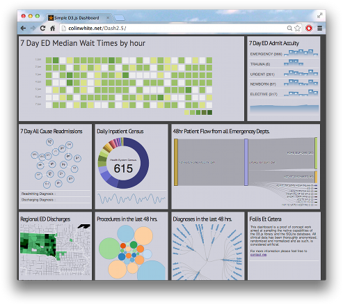

# D3.js and SQLite #
## Data visualization and Proof of Concept ##
A simple hospital dashboard illustrating concurrent clinical operations. Written predominately in Javascript and conforming to MVC, it uses a SQLite data store and some simple PHP accessors.
 

Based on the following Creative Commons and Open Source prior work .

#### HTML5 Boilerplate ####
by Catalin Maris [https://github.com/alrra](https://github.com/kamisama/cal-heatmap) 

#### D3.js Data Driven Documents ####
by Mike Bostock

[https://github.com/mbostock/d3](https://github.com/mbostock/d3)

[https://github.com/mbostock/queue](https://github.com/mbostock/queue)

[https://github.com/mbostock/topojson](https://github.com/mbostock/topojson)

[https://github.com/d3/d3-plugins/tree/master/sankey](https://github.com/d3/d3-plugins/tree/master/sankey)

#### D3.js Tool Tips ####
by Justin Palmer [https://github.com/Caged/d3-tip](https://github.com/Caged/d3-tip)

#### Cal-HeatMap ####
by Wan Qi Chen [https://github.com/kamisama/cal-heatmap](https://github.com/kamisama/cal-heatmap) 

#### Special thanks...####
Lars Kuttohff

[http://stackoverflow.com/users/1172002/lars-kotthoff](http://stackoverflow.com/users/1172002/lars-kotthoff)